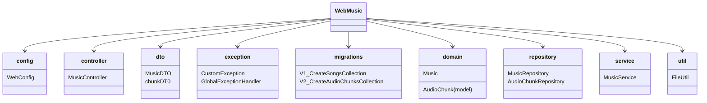

# web_music

```mermaid
classDiagram
    direction TB
    class WebMusic
    
  class config {
    WebConfig
  }
   
  class controller {
    MusicController
  }
   
  class dto {
    MusicDTO
    chunkDT0
  }
   
  class exception {
    CustomException
    GlobalExceptionHandler
  }
   
  class migrations {
    V1_CreateSongsCollection
    V2_CreateAudioChunksCollection
  }
   
  class domain {
    Music
    AudioChunk(model)
  }
   
  class repository {
    MusicRepository
    AudioChunkRepository
  }
   
  class service {
    MusicService
  }
   
  class util {
    FileUtil
  }
   
  WebMusic --> config
  WebMusic --> controller
  WebMusic --> dto
  WebMusic --> exception
  WebMusic --> migrations
  WebMusic --> domain
  WebMusic --> repository
  WebMusic --> service
  WebMusic --> util
```
